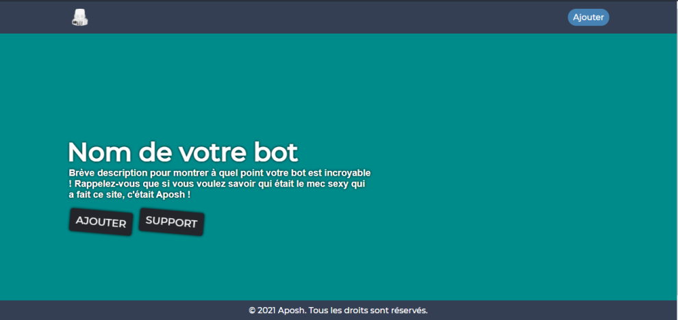

# :tv: SITE WEB SIMPLE POUR LES BOTS DISCORD

## `1 -` **|** Introductions:

Il est toujours préférable pour votre bot discord d'avoir un site Web pour afficher ces simples boutons d'ajout et de support. Dans cet esprit, j'ai développé un site Web simple que vous pouvez personnaliser et utiliser dans votre hébergement. N'oubliez pas que ce site Web est réactif, alors ne vous inquiétez pas lorsque vous consultez votre site Web à partir de votre ordinateur ou de votre téléphone portable. __Merci de ne pas retiré les crédits !__

<br 

## `2 -` **|** Langues utilisées:

Le projet a été développé avec seulement 2 langues, **HTML5** et **CSS3**, alors ne vous inquiétez pas de comprendre d'autres langues et de perdre du temps à vous cogner la tête !

## `3 -` **|** Liens:

- [Mon Twitter](https://twitter.com/wii_aposh)

## `4 -` **|** Auteur:

| [ @Aposh](https://github.com/apoow3b) |
| :---: | 
